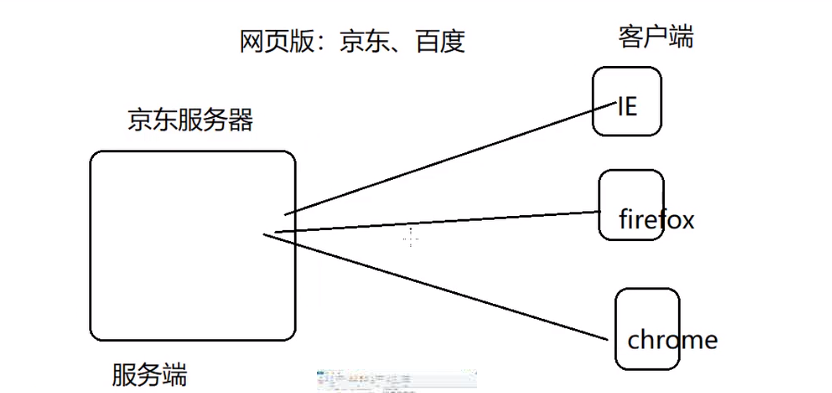

[视频教程](https://www.bilibili.com/video/av29086718)学习笔记

#  第一节 jsp入门

## 1 动态页面

动态页面重点并不在于它是否有动感，而在于网页内容会不会随着时间、地点、用户操作而变化。动态页面需要使用到服务端脚本语言。

## 2 架构

### （1）CS架构

CS架构就是 Client -Server。

上图就是一个cs架构。

CS架构的缺点：

-   如果软件升级，那么全部客户端上的软件都需要升级
-  维护麻烦：需要维护每一台客户端软件
-  每一台客户端都需要安装软件

### （2）BS架构

BS架构就是Browser-Server。

 

BS架构只需要浏览器即可，维护也方便

**注意**BS与JCS各有优势，BS并不是CS的替代品。CS的页面更加美观，响应速度也比较快。两者各有利弊。

### （3）关于jsp

#### Tomcat

**目录**：

- bin中主要放可执行文件，比如startup.bat、shutdown.bat
- conf 主要放配置文件
- lib 存放tomcat依赖的jar包
- log 日志文件
- temp 临时文件
- webapps 存放可执行的项目（把我们开发的项目放于此）
- work 存放特殊的临时文件：主要是由jsp翻译成的java以及编译的class文件，jsp→java→class

软件配置：要先配置jdk，再配置tomcat，具体略。

**访问tomcat**：

要访问的项目都在webapps中，默认访问ROOT，如果要访问别的项目，在url后加斜杠跟项目名称。比如要访问example项目，可访问localhost:8888/example。

example的默认页面是index.html，若要修改默认项，需要修改WEB-INF中的web.xml中的welcome-file-list：

如图，tomcat会依次检索上述文件，都找不到时，会报404错误。

**自己新建项目**：

项目文件夹中必须要有WEB-INF以及其中的web.xml。同时WEB-INF中还可以有class文件夹存放class文件，lib文件夹存放依赖包。

# 第二节 虚拟路径和虚拟主机

## 1 虚拟路径

指默认访问到webapps中的项目。可以修改虚拟路径指向别的文件夹。

修改方式：

（1）可以通过修改server.xml修改虚拟路径：

访问path就相当于访问docBase，其中path是相对于webapps的相对路径。

修改完成后需要重启。

（2）在conf/Catalina/localhost中新建项目名.xml文件，把上图中的context语句写入其中即可，此方式不需要重启。

## 2 虚拟主机

在server.xml新写Host语句:

其中path被写成了"/"，也就是说访问localhost时直接访问docBase项目。

修改defaultHost：

修改本机host文件，添加映射：

# 第三节 jsp执行过程

第一次访问时：jsp→java→class，之后每次直接访问class，每当jsp文件内容改变时，需要重新执行翻译、编译过程。

# 第五节JSP页面元素以及request对象

jsp三种注释形式：html（可通过源码看到）、java、jsp

9种内置对象（面试常考）：

1. out：用于向客户端输出内容

2. request：请求对象，存储客户端向服务端发送的请求信息，常用request对象方法：
   - String getParameter(String name): 根据请求的字段名key，返回字段值value
   - Srting[] getParameter（String name)：根据请求字段名key，返回多个字段值value
   - void setCharacterEncoding("编码格式utf-8")：设置请求编码
   - getRequestDispatcher("b.jsp").forward(request, response)：请求转发的方式跳转页面，A→B
   - ServletContext getServerContext(): 获取项目的ServletContext对象。
3. response
4. pageContext
5. session
6. application
7. config
8. page
9. exception

