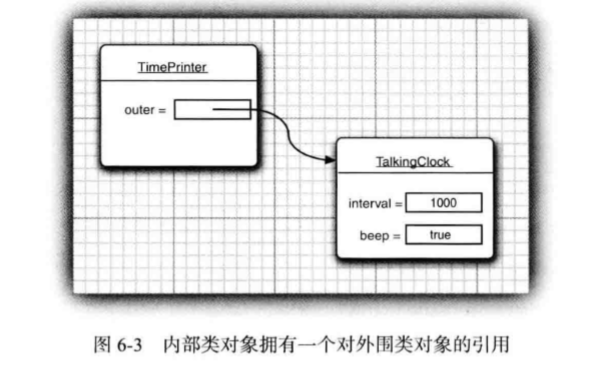
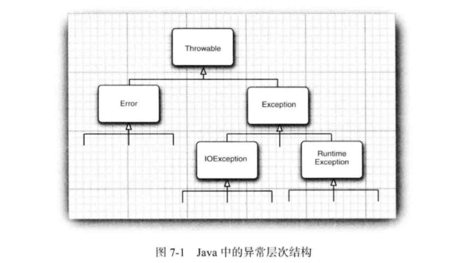

#  第五章 继承

## 5.1 类、超类和子类

超类和子类之间有明显的is-a关系

### 5.1.1 定义子类

### 5.1.2 覆盖方法

子类中不可直接访问父类的私有域，必须借助公用的接口，在使用父类的接口时，要用super调用父类方法；

super与this不同，它不是对对象的引用，而只是一个指示编译器调用父类方法的特殊关键字

### 5.1.3 子类构造器

- 用super调用父类构造器
- 子类没有显示地调用父类构造器，会隐式调用父类不带参数的构造器，如果此构造器在父类没有定义，会出现异常

### 5.1.4 继承层次

### 5.1.5 多态

- is-a规则，即置换法则，表明程序中出现超类对象的地方都可以用子类对象置换
- 不能将一个超类的引用对象赋给子类变量（个人：除非采用强制转型且该超类对象的实际对象为子类对象）
- 见核心技术第10版155页；子类数组的引用可以转换成超累数组得引用，而不需要采用强制类型转换。这样做会引发风险。
- 见核心技术第10版154页；和上一条有什么区别。这一条中把变量当作超类就用超类中的方法，当作子类就用子类中的方法，没毛病；而在上一条数组情况中，却没有办法实现，因为如果在数组中加入一个超类实例，在子类数组调用该实例调用子类方法就会出问题。

### 5.1.6 理解方法调用

- 静态绑定和动态绑定
- 方法表的使用

### 5.1.7 阻止继承：final类和方法

同时还可以阻止动态绑定

###  5.1.8  强制类型转换

instanceof关键字

### 5.1.9 抽象类

抽象类不可实例化；没有抽象方法也可以成为抽象类

### 5.1.10 受保护的访问

Object类中的clone是典型的protected方法

<hr/>

## 5.2 Object： 所有类的超类

基本类型不是对象

### 5.2.1 equals 方法

为了防止null的情况，可以使用Object的equals方法，如 果两个参数都为 null， Objects.equals(a，b) 调用将返回 true ; 如果其中一个参数为 null, 则返回 false ; 否则， 如果两个参数都不为 null， 则调用 a.equals(b)

### 5.2.2 相等测试与继承

- 自反性，对称性，传递性，一致性，对于任意非空x，与null进行equals返回false

- 由子类决定相等概念，处于对称性需采用getClass，由超类决定可使用instanceof

- 编写equals的完美流程

### 5.2.3 hashCode 方法

重新定义equals时要重新定义hashCode方法，如果equals为true，哈希值也应当相同

### 5.2.4 toString 方法

<hr/>

## 5.4 包装器与自动装箱

<hr/>

## 5.5 参数可变的方法

<hr/>

## 5.6 枚举类

<hr/>

## 5.7 反射

### 5.7.1 Class类

某类.class  某对象.getClass()  Class.forName()

### 5.7.3 用某些反射类分析

Class类  getFields、getMethods、getConstructors  单复数，Declared

Modifier类：toString方法

Field、Method、Constructor类  ：getModifiers 返回int  getName,  getReturnType

### 5.7.4 在运行时使用反射分析对象

获得Field对象，传入引用变量使用get、set方法

### 5.7.5 使用反射编写泛型数组代码

不好的示范：

```java
public static Object[] badCopyOf(Object[] a, int newLength) // not useful
{
	Object[] newArray = new Object[newlength];
    System.arraycopy(a, 0, newArray, 0, Math.min(a.length, newLength)); 
    return newArray;
} 
```

个人：Object[]无法**向下转型**！！因为一开始就是定义的Object！

```java
//更好的做法
public static Object goodCopyOf(Object a, int newLength)
{
   Class cl = a.getClass()； 
   if (cl.isArrayO) return null; 
   Class componentType = cl.getComponentType0； 
   int length = Array.getLength(a); 
   Object newArray = Array.newlnstance(componentType, newLength):                    
   System.arraycopy(a, 0, newArray, 0, Math.min(length, newLength)); 
   return newArray; 
}
```

```java
int a = {1，2, 3, 4, 5 }; a = (int[]) goodCopyOf(a, 10);
```

### 5.7.6 调用任意方法

Method类中的invoke   Object invoke(Object obj, Object..args)

对于静态方法第一个参数忽略，

```java
Method ml = Employee.class.getMethod("getName"); 
Method m2 = Employee.class.getMethod("raiseSalary", double.class);
// double.class!=Double.class!!
```

注意转型

<hr/>

# 第六章 接口、lambda表达式与内部类

## 6.1 接口

### 6.1.1 接口的概念

"如果遵从某个特定的接口，那么就履行这项服务";

接口中所有方法都自动地属于public;

```java
//经典接口 Comparable：
public interface Comparable{
    public int compareTo(Object other);
}
```

```java
//java8后已经实现了泛型
public interface Comparable<T>{
    public int compateTo(T other);
}
```

```java
//两个常用方法
Integer.compare(int x, int y)
Double.compare(double x, double y)
```

compare方法面临与equals一样的问题，即是子类定义相等概念还是父类定义；

如果子类定义需进行类型检查，类型不符抛出异常；

父类定义可声明一个final方法

### 6.1.2 接口的特性

```java
//接口可以像类一样继承，称之为扩展
public interface Moveable{
    void move(double x, double y);
}

public interface Powered extends Moveable{
    double milePerGallon();
    double SPEED_LIMIT = 95;
}
//接口中不能包含实力域或者静态方法，但是可以定义常量， 默认为public static final
```

### 6.1.3 接口与抽象类

问：既然有类可以继承，为什么还需要接口呢？

答：因为java不支持多重继承，每个类只能最多有一个父类，而接口可以实现多个。

### 6.1.4 静态方法

java8后可以在接口中实现静态方法，“理论上是可以的，只是背离了接口设计的初衷”。

```java
public interface Path{
    public static Path get(String first, String...more){
        return FileSystems.getDefault().getPath(first, more);
    }
    ...
}
```

### 6.1.5 默认方法

问：啥是默认方法？

答： 用**default** 关键字为接口中的方法添加默认实现

```java
//例如
public interface Comparable<T>{
    default int compareTo(T other){return 0;}
}
//这还暂时看不出来有什么用
```

问：这有啥用处？

答：用处如下：

```java
public interface MouseListener{
    default void mouseClicked(MouseEvent event){}
    default void mousePressed(MouseEvent event){}
    default void mouseReleased(MouseEvent event){}
    default void mouseEntered(MouseEvent event){}
}
// 添加了默认方法后，只关注其中需要的方法就可，其余方法有了默认实现不用关心
```

```java
public interface Collection{
    int size();
    default boolean isEmpty(){
        return size()==0;
    }
}
//这样子类就不用关心isEmpty的实现了，有点超类方法继承的意思
```

```java
//在 JavaAPI 中，你会看到很多接口都有相应的伴随类，这个伴随类中实现了相应接口的部分或所有方法， 如CoUection/AbstractCollectkm或 MouseListener/MouseAdapter。在 JavaSE 8 中， 这个技术已经过时。现在可以直接在接口中实现方法。 
```

```java
//默认方法可用于接口演化。即在接口中新增方法时，可以设置为默认方法，那样在旧版本中实现了此接口又不需要新方法的类就可以免遭其害。
```

### 6.1.6 解决默认方法的冲突

问：什么是默认方法冲突？

答：一个接口中的默认方法与其它超类中的方法或其它接口中的方法（不一定要默认）相同。

问：怎么解决？

答：两条原则：

```java
   -  超类优先：很好理解，接口要求实现一个方法，继承了超类的方法正好就实现了，天上掉馅饼；
   -  接口冲突时：由程序员指定。
```

<hr/>

## 6.2 接口示例

### 6.2.1 接口与回调

> 通过类名导入了java.swing.Timer。这就消除了javax.swing.Timer与java.util.Timer之间产生的二义性

### 6.2.2 Comparator接口

```java
//经典的比较器接口，常用于排序
public interface Compatator<T>{
    int compare(T first, T second);
}
```

### 6.2.3 对象克隆

问：克隆方法的难点在哪？

答：在于引用变量的拷贝。对于不可变变量来说，更改克隆对象只会创造一个新变量，对于原对象中的变量没有影响；对于引用变量来说，改变克隆对象中变量同时会改变原对象中的变量。因此需要深复制。

问：关于Cloneable接口？

答：这是一个标记接口，本身不包含任何方法，但是凡是实现了clone方法的类必须实现该接口，否则会报错。

问：关于子类实现clone方法？

答：我个人认为，这跟递归差不多，见下面代码：

```java
class Employee implements Cloneable{
	...
    Employee clone() throws CloneNotSupportException
    {
        Employee cloned = (Employee) super.clone();
        cloned.hireDay = (Date) hireDay.clone();
        return cloned;
    }
}
```

问：你还会了什么？

答：克隆并不常用，标准库只有不到5%的类实现了此方法；所有数组都有一个public的clone方法

<hr/>

## 6.3 lambda表达式

### 6.3.1 为什么引入lambda表达式

```java
public LengthComparator implements Comparator<String>
{
    public int compare(String first, String second){
        return first.length() - second.length();
    }
}
...
Arrays.sort(String, new LenthComparator());
//在上述代码中需要给sort方法重新传入一个Comparator，因此在编辑完LengthComparator类之后
//还要new一个对象在传参
//而我们真正需要的只是新定义的排序规则而已
//labmda的出现就是为了解决这个问题，我们可以直接传入代码块而不需要新建对象
```

### 6.3.2 lambda表达式的语法

```java
//只需要一个表达式
(String first, String second)->first.length()-second.length()
//需要多个表达式, 用大括号括号
(String first, String second)->
{
    if(first.length()<second.length()) return -1;
    else if(first.length()>second.length()) return 1;
    else return 0;
}
//没有参数，也需要括号
()->{for(int i=0;i<5;i++)System.out.println(i);}
//如果可以推导出参数类型，可以忽略其类型
//如果可以推导类型且且只有一个参数，可以省略圆括号
//无需制定lambda返回值的类型
```

### 6.3.3 函数式接口

问：什么是函数式接口？

答：对于只有一个**抽象方法**的接口，需要这种接口的对象时，就可以提供一个lambda表达式，这种接口称为函数式接口。

### 6.3.4 方法引用

```java
object::instanceMethod
Class::staticMethod
Class::instanceMethod
//前两种情况中，直接将变量作为参数传递给方法，例如：
//Math::pow 等价于(x, y)->Math.pow(x, y)
//最后一种情况，第一个参数会成为调用方法的实例，例如：
//String::compareToIgnoreCase等价于(x, y)->x.compareToIgnoreCase(y)
//编译器会自动地在重构的方法中找到实际需要的方法
//使用this参数，例如：
//this::equals 等价于 x->x.equals(x)
//使用super参数，个人：同this差不多，只不过方法会替换成超类中的方法
```

### 6.3.5 构造器的引用

```java
ArrayList<String> names = ....;
Stream<Person> stream = names.stream().map(Person::new);
int[]::new 等价于 x->new int[x]
//还不太明白，以后再说吧
```

### 6.3.6 变量作用域

```java
//可以在lambda表达式中访问外围变量
public static void repeatMessage(String text, int delay)
{
    ActionListener listener = event ->
    {
        System.out.println(text);
    };
}//访问text
```

```java
//在lambda表达式中引用的外围变量不可改变
public static void countDown(int start, int delay)
{
	ActionListener listener = event->
    {
        start--;
        System.out.println(start);
    };
}//这样是错的！！！

public static void repeat(String text, int count)
{
    for(int i=0;i<10;i++){
        ActionListener listener = event->
        {
            System.out.println(i);
        };
    }
}//这样也是错的！！
//这主要是为了防止在并发执行中出错
```

```java
//在lambda中声名一个与局部变量同名的参数或者局部变量是非法的
Path first = Paths.get("/usr/bin")
Comparator<String> comp = 
    (first, second)->first.length()-second.length();
//Error!!!!!
```

```java
//在lambda使用this使，是指创建这个表达式的方法的this参数
public class Application{
    public void init(){
        ActionListener listener = event ->
        {
            System.out.println(this.toString())
        };
    }
}
//调用Application对象的toString方法
```

### 6.3.7 处理lambda表达式

- 列举了一些函数式接口
- lambda的特征是延迟执行
- Predicate.isEqual(a)等同于a::equals，Predicate的源码

### 6.3.8 再谈Comparator

各种骚操作，暂时按下不表

<hr/>

## 6.4 内部类

问：为什么要使用内部类呢？

答：好处多多：

1. 内部类可以访问该类定义的所在作用域中的数据，包括私有的数据；
2. 内部类可以对同一个包中的其他类隐藏起来；
3. 当想定义一个回调函数且不想编写大量代码时，使用匿名内部类比较方便。

### 6.4.1 使用内部类访问对象的状态

```java
public class TalkingClock
{
    private int interval;
    private boolean beep;
    public TalkingClock(int interval, boolean beep){
        this.interval = interval;
        this.beep = beep;
    }
    public void start(){
        ActionListener listener = new TimePrinter();
        Time t = new Timer(interval, listener);
        t.start();
    }
    public class TimePrinter implements ActionListener{
        System.out.println("At the tone, the time is" + new Date());
        if(beep) Toolit.getDefaultToolkit().beep();
    }
}
//正如代码所显示的，内部类TimePrinter访问了TalkingClock的私有变量beep
```



```java
//actionPerformed方法等价于下列形式
public void actionPerformed(ActionEvent event)
{
    System.out.println("At the tone, the time is" + new Date());
    if(outer.beep) Toolkit.getDefaultToolkit().beep();
}
//outer并不是java的关键字，我们只是用来说明机制
```

```java
//编译器实际上修改了内部类的构造器，给予了一个外围类的引用参数
public TimePrinter(TalkingClock clock)
{
    outer = clock;
}
```

```java
//内部类可以声明为私有的，这样只有外围类可以声明内部类对象
```

### 6.4.2 内部类的特殊语法规则

```java
//实际上外围类引用的正规语法是这样的：OuterClass.this
public void actionPerformed(ActionEvent event){
    ...
    if(Talking.this.beep) Toolkit.getDefaultToolkit().beep();
}
```

```java
//可以采用此种语法构造内部类：outerObject.new InnerClass(constructor params)
ActionListener listener = this.new TimePrinter()
```

```java
//在外围的作用域之外，可以这样引用内部类(内部类是private则不可访问(个人))
TalkingClock jabberer = new TalkingClock(1000, true);
TalkingClock.TimePrinter listener = jabberer.new TimePrinter();
//存疑：静态内部类是不是不一样？
//内部类中所有静态域必须是final；
//内部类不能有static方法，Java语言规范没有任何解释
```


### 6.4.3 内部类是否有用、必要和安全

```java
//对于内部类TimePrinter调用ReflectionTest程序打印下列内容
public class TalkingClockSTimePrinter { 
    public TalkingClock$TimePrinter(TalkingCtock);
    public void actionPerformed(java.awt.event.ActionEvent);
	final TalkingClock this$0;//可以看到保存了外围类引用，
}//个人：在静态类中不需要引用外围类对象，因此可以设为静态
```


### 6.4.4 局部内部类

```java
//TimePrinter这个类只在start方法中用了一次，因此完全可以定义成局部内部类
public void start(){
    class TimePinter implements ActionListener{
        public void actionPerformed(ActionEvent event){
            System.out.println("At the tone, the time is" + new Date());
            if(beep) Toolkit.getDefaultToolkit().beep();
        }
    }
    ActionListener listener = new TimePrinter();
    Timer t = new Timer(interva, listener);
    t.start();
}
```

### 6.4.5 由外部方法访问变量

```java
//与其它内部类相比，局部内部类不仅可以访问包含它们的外部类，还可以访问局部变量
//对上一节的代码中做一些小改动，添加局部变量，在局部内部类中访问变量beep
public void start(int interval, boolean beep){
    class TimePinter implements ActionListener{
        public void actionPerformed(ActionEvent event){
            System.out.println("At the tone, the time is" + new Date());
            if(beep) Toolkit.getDefaultToolkit().beep();
        }
    }
    ActionListener listener = new TimePrinter();
    Timer t = new Timer(interva, listener);
    t.start();
}
//！！需要注意，局部内部类引用的变量事实上为final，一旦赋值就不可改变
//当创建一个对象时的时候，局部变量就会被传递被构造器，并储存在一个final变量中
//利用上一章中的反射检查程序ReflectionTest，会看到下面结果
public TalkingClock$TimePrinter
{
    TalkingClock$TimePrinter(TalkingClock, boolean);
    public void actionPerformed(java.awt.event.ActionEvent);
    final boolean val$beep;  //储存在此
    final TalkingClock this$0;
}
//所以可以将引用的局部变量定义为final，使得它在初始化后与局部类内建立的拷贝始终一致
```

```java
//这个例子中局部变量发生了改变，是错误的
int counter = 0;
Date[] dates = new Date[100];
for(int i=0;i<dates.length;i++){
    dates[i] = new Date(){
        public int compareTo(Date other)
        {
            counter++;  //错误！！
            return super.compareTo(other);
        }
    };
}
Arrays.sort(dates);
//可以用长度为1的数组补救，final对引用变量来说只是指向性不变
int[] counter = new int[1];
...
for(....){
    dates[i] = new Date(){
      public int compareTo(Date other)
      {
          counter[0]++;
          .....
      }
    };
}
....
```


### 6.4.6 匿名内部类

```java
//假如局部内部类只创建一个对象，就不需要命名了，可使用匿名内部类
public void start(int interval, boolean beep) { 
    ActionListener listener = new ActionListener()
    { 
        public void actionPerformed(ActionEvent event) { 
            System.out.println("At the tone, the time is " + new DateO); 
            if (beep) Toolkit.getDefaultToolkit().beep(); 
        } 
    };
    Timer t = new Timer(interval, listener); 
    t.start();
}
//通常的语法格式为：
new SuperType(construction parameters) {
    inner class methods and data 
}
//SuperType可以是ActionListener这样的接口，于是内部类就要实现这个接口。
//它也可以是一个类，内部类就要扩展它
//匿名内部类由于没有名称，所以不能有构造器
//实际上，使用lambda表达式最方便
public void start(int interval, boolean beep){
    Timer t = new Timer(interval, event->{
        System.out.println("At the tone, the time is " + new DateO); 
        if (beep) Toolkit.getDefaultToolkit().beep(); 
    })；
    t.start();
}
//别忘了lambda也可以访问局部变量哦
```

```java
//几个技巧和注意事项
//双括号初始化
ArrayList<String> friends = new ArrayList<String>(){//改写了书中代码，可能有错
    {add("Harry");add("Tony");}//实际上添加了新的构造块，见第4章
};
//在equals方法中用getClass方法做检测时，对于匿名内部类来说会失效
```


### 6.4.7 静态内部类

```java
//对于不需要引用外围类对象的内部类，可以声明为为static
//下面的类找出、保存最大最小两个值
class Pair
{
    private double first;
    private double second;
    public Pair(double f, double s)
    {
        first = f;
        second = s;
    }
    public double getFirst(){return first;}
    public double getSecond(){return second;}
}
class ArrayAlg
{
    public static Pair minmax(double[] values)
    {
        ...
        return new Pair(min, max)
    }
}
//由于Pair这个名字太常见了，为了解决冲突，可以把Pair写在ArrayAlg内部
//由于Pair并不需要引用其他对象，可以设为静态的
class ArrayAlg
{
    public static class Pair
    {
       ...
    }
    ....
}
//上述例子中，必须使用静态内部类，因为内部类对象是在静态方法中构造
/*个人：
  6.4.3中内部类构造器需要传递一个外围类对象；
  6.4.2中构造内部类实例语法为 this.new TimePrinter(),this可省略实际上this就是传给构造   器的隐形参数；
  而在静态方法中，并没有实例对象只有类，所以需要在静态方法中构造对象的内部类需要定义为静态内	   部类；
*/  
//与常规内部类不同，静态内部类可以有静态于和方法
//声明在接口中的内部类自动声明为static和public类
```


<hr/>

## 6.5 代理

利用代理可以在运行时创建一个实现了一组给定接口的新类。这种功能只有在编译时无法确定需要实现哪个接口时才有必要使用。对于应用程序设计人员来说，遇到这种情况的机会很少，对于系统程序设计人员来说，代理带来的灵活性却十分重要。

暂时跳过。

<hr/>

# 第7章 异常、断言和日志

程序应当在出现错误时做到以下几点：

1. 向用户通告错误
2. 保存所有的工作结果
3. 允许用户以妥善的形式退出程序

## 7.1 处理错误

- 用户输入错误
- 设备错误：打印机没纸等硬件问题
- 物理限制：磁盘满了
- 代码错误

### 7.1.1 异常分类



- Error类层次结构描述了Java运行时系统的内部错误和资源耗尽错误，应用程序不应该抛出这种类型的错误
- 在设计Java程序时，需要关注Exception层次结构。其中的RuntimeException是程序错误导致的异常；程序本身没有问题，由于IO错误导致的异常属于IoException
- 如果出现RuntimeException，那么就一定是你的问题
- 派生于Error和RuntimeException的异常称之为非受查异常，其余的称之为受查异常

### 7.1.2 声明受查异常

- 不需要声明Java的内部错误，即从Error继承的错误。任何程序代码都具有抛出那些异常的潜能，而我们对其没有任何控制能力
- 总之，一个方法必须声明所有可能抛出的受查异常，而非受查异常要么不可控制(Error)，要么就应该避免发生(RuntimeException)

### 7.1.3 如何抛出异常

用throws、throw关键字

### 7.1.4 创建异常类

```java
//定义的类型当包括两个构造器，一个默认，另一个是带有详细描述信息的构造器
class FileFormatException extends IOException { 
    public FileFormatException() {}
    public FileFormatException(String gripe) { super(gripe); } 
}
```

## 7.2 捕获异常

### 7.2.1 捕获异常

try catch 语法

### 7.2.1 捕获多个异常

### 7.2.2 再次抛出异常与异常链

```java
//将原始异常设为新异常的原因
try 
{
   ...
}
catch (SQLException e)
{
    Throwable se = new ServletException("database error");
    se.initCause(e);
    throw se;
}
```

### 7.2.4 finally子句

```java
//当finally子句包含return语句时，将会出现一种意想不到的结果，假设利用return语句从try语句块中退出。在方法返回前，finally子句的内容将被执行。如果finally子句中也有一个return语句，这个返回值将会覆盖原始的返回值。
```

### 7.2.5 带资源的try语句

> 上一节已经看到，如果 try块抛出一个异常， 而且 close 方法也抛出一个异常，这就会带 来一个难题.，带资源的 try语句可以很好地处理这种情况。原来的异常会重新抛出，而 close 方法抛出的异常会“ 被抑制％ 这些异常将自动捕获，并由 addSuppressed 方法增加到原来的 异常。

### 7.2.6 分析堆栈轨迹元素

标记一下，以后再看

## 7.3 使用异常机制的技巧

1. 异常处理不能代替简单的测试
2. 不要过分地细化异常
3. 利用异常层次结构
4. 不要压制异常
5. 在检测错误时，“苛刻”要比放任更好
6. 不要羞于传递异常

## 7.4 断言

略过，以后看

## 7.5 记录日志

太复杂了，时间较紧，以后再看

<hr/>

# 第8章 泛型程序设计

## 8.1 为什么要使用泛型程序设计

> 泛型程序设计意味着编写的代码可以被很多不同类型的对象所复用

### 8.1.1 类型参数的好处

可以避免参数转换所带来的麻烦和错误，给程序带来更好的安全性和可读性

### 8.1.2 谁想成为泛型程序员

我好像不太想

## 8.2 定义简单泛型类

尖括号括住泛型形参放在类名后面即可

```java
public class Pair<T> {
    private T first; 
    private T second;
	public Pair() { first = null; second = null; }
    public Pair(T first, T second) {
        this.first = first; this.second = second; 
    }
	public T getFirst() { return first; } 
    public T getSecond() { return second; }
	public void setFirst(T newValue) { first = newValue; }
    public void setSecond(T newValue) { second = newValue; }
}
```


## 8.3 泛型方法

```java
//例如
class ArrayAlg {
    public static <T> T getMiddle(T... a)  //泛型形参放在返回值前面，修饰符后面
    { 
        return a[a.length / 2];
    } 
}
//调用泛型方法时，可以在方法名前面放置方括号，然后放入具体类型
String middle = ArrayAlg.<String>getMiddle("John", "Tom", "lueluelue");
//大多数情况下，编译器可以自动推断出泛型类型，可以省略尖括号
String middle = ArrayAlg.getMiddle("John", "Tom", "lueluelue");
//下面的情况会报错
double middle = ArrayAlg.getMiddle(3.14, 1729, 0);
//首先编译器会自动装箱，然后寻找它们的超类，最后发现它们的共同超类有两个Number和Comparable
//从而引发错误
```

```java
//以下内容来自https://blog.csdn.net/briblue/article/details/76736356
//泛型类与泛型方法共存现象
public class Test1<T>{

	public  void testMethod(T t){
		System.out.println(t.getClass().getName());
	}
	public  <T> T testMethod1(T t){
		return t;
	}
}
//其中testMethod1是个泛型方法，它的类型参数虽然与Test1类的类型参数名字相同，但是两者其实是毫无干系的两个类型参数
```


## 8.4 类型变量的限定

```java
class ArrayAlg
{
	public static <T> T min(T[] a)
    {
        if(a==null||a.length==0) return null;
        T smallest = a[0];
        for(int i=1;i<a.length;i++)
            if(a[i].compareTo(smallest)<0) smallest = a[i];
        return smallest;
    }
}
//程序中调用了compareTo方法，如何确保a中的成员变量具有compareTo方法呢？
//可以把它们都限定为Comparable接口的子类
public static <T extends Comparable> T min(T[] a)...
//无论是类还是接口，限定关键字都用extends
//可以多重限定，用&连接超类或接口，如果有超类那只能有一个（Java没有多重继承）且要放在首位
```

## 8.5 泛型代码和虚拟机

> 虚拟机没有泛型类型对象——所有的对象都属于普通类

### 8.5.1 类型擦除

> **泛型信息只存在于代码编译阶段，在进入 JVM 之前，与泛型相关的信息会被擦除掉，专业术语叫做类型擦除**
>
> -https://blog.csdn.net/briblue/article/details/76736356

```java
//无论何时定义一个泛型类，都自动提供了一个原始类型
//例如Pair的原始类型
public class Pair { 
    private Object first; 
    private Object second; 
    public Pair(Object first, Object second) 
    { 
        this,first = first; 
        this.second = second;
    }
	public Object getFirst() { return first; } 
    public Object getSecond() { return second; } 
    public void setFirst(Object newValue) { first = newValue; } 
    public void setSecond(Object newValue) { second = newValue; }
}
//Pair的T是个无限定变量，所以用Object替换
//若有限定，则用第一个限定的类型变量来替换
```

### 8.5.2 翻译泛型表达式

> 程序调用泛型类的泛型方法时，如果擦除返回类型，编译器插入强制类转换

```java
//例如下面的语句
Piar<Employee> buddies = ...;
Employee buddy = buddies.getFirst()
```

> 擦除getFirst的返回类型后将返回Object类型，编译器自动插入强制类型转换
>
> 也就是说编译器把这个方法调用翻译成两条虚拟机指令
>
> - 对原始方法Pair.getFirst的调用
> - 对返回的Object类强制转换为Employee类型

### 8.5.3 翻译泛型方法

```java
//一个泛型方法翻译小栗子
public static <T extends Comparable> T min(T[] a)
//翻译后
public static Comparable min(Comparable[] a)
```

翻译泛型方法有时会引起多态冲突

```java
class DateInterval extends Pair<LocalDate>
{
    public void setSecond(LocalDate second)
    {
        //要保证第二个日期大于第一个日期
        if(second.compareTo(getFirst())>=0)
            super.setSecond(second);
    }
    ......
}
//这个类擦出后，变成
class DateInterval extends Pair
{
    public void setSecond(LocalDate second){.....}
    ....
}
//但是！！！！类中还存在从Pair原始类中继承下来的方法
public void setSecond(Object second)
//个人：相当于有两个方法，是彼此的重载
//然后执行下面的语句
DateInterval interval = new DateInterval(...);
Pair<LocalDate> pair = interval;//向上转型
pair.setSecond(aDate);
//个人：首先pair编译类型为父类，因此只能调用父类才有的方法，即参数为Object的方法，运行时显示子类的方法特征，即调用DateInterval类参数为Object的方法
//在接着说，为了避免多态冲突，编译器会生成一个桥方法
public void setSecond(Object second){setSecond((Date) second);}
//这样调用子类的参数为Object的方法后又调用了子类参数为LocalDate的方法（是不是书的错误我也不确定，也许不应该是Date而是LocalDate），这样就调用了我们需要的方法
```

> 总之要记住有关Java泛型的事实
>
> - 虚拟机中没有泛型，只有普通的类和方法
> - 所有的类型参数都用它们的限定类型替换
> - 桥方法合成来保持多态
> - 为保持类型安全性，必要时插入强制类型转换

### 8.5.4 调用遗留代码

> 在设计Java泛型时，主要目标是允许泛型代码和遗留代码之间能够互相工作

```java
//看一个具体的例子，要设置一个JSlider标签，可以使用方法
void setLabelTable(Dictionary table)
//现在填充字典时，一般使用泛型类型
Dictionary<Integer, Component> labelTable = new Hashtable<>();
labelTable.put(0, new JLabel(new ImageIcon("nine.gif")));
slider.setLabelTable(labelTable);
/*给方法传参时，编译器会发出警告（个人觉得定义方法时参数没有使用泛型），因为编译器无法确定方法会对字典做什么操作，比如用字符串替换字典中的关键字，打破类型限制*/
//但是实际上，这个方法只会查看字典中的信息，因此完全可以忽略警告
//还可以从方法中获得泛型实例
Dictionary<Integer, Components>labelTable = slider.getLabelTable(); // Warning
//编译器会发出警告，需要确保标签表的类型是Integer和Component
//只要自己清楚里面不会有别的类型就可以不用太关注这个警告（个人）
//可以用注解使警告消失，放在代码前
@SuppressWarnings("unchecked")
Dictionary<Integer, Components>labelTable = slider.getLabelTable(); // No warning
//或者标注整个方法
@SuppressWarnings("unchecked") 
public void configureSlider() { . . . } 
```

## 8.6 约束与局限性

> 阐述使用 Java 泛型时需要考虑的一些限制。大多数限制都是由**类型擦除**引起的。
>
> 重点，类型擦除

### 8.6.1 不能使用基本类型实例化类型参数

就是不能用int而要用Integer等等

### 8.6.2 运行时类型查询只适用于原始类型

```java
Pair<String> stringPair = . .
Pair<Employee> employeePair = . . 
if (stringPair.getClass() == employeePair.getClass()) // they are equal 
//他们的类型都是原始类型，也只有原始类型r详见类型擦除
//这种类型检测也是错误的
if (a instanceof Pair<String>) // Error
if (a instanceof Pair<T>) // Error
Pair<String> p = (Pair<String>) a; // Warning-can only test that a is a Pair
```

### 8.6.3 不能创建参数化类型数组

```java
//例如
Pair<String>[] table = new Pair<String>[10]; // Error，这一步会编译报错
//然后进行下列操作
Object[] objarry = table;
//下面这条指令会抛出ArrayStoreException异常
objarry[0] = "123";
//但是对于泛型类型，由于类型擦除的原因，会使这种机制无效（个人：都擦除成Object了，都成一样的
//下面的语句可以通过储存检查，但是仍会导致一个类型错误
//见书第十版322页：因为数组存储只会检查擦除的类型
objarray[0] = new Pair<Employee>();
//但是允许声名泛型数组，但是不能初始化
//可以声明通配类型数组，然后强制转换
Pair<String>[] table = (Pair<String>[]) new Pair<?>[10];
//但是仍不安全
table[0] = new Pair<Employee>();
table[0].getFirst().toUpperCase() //会报错
//如果要收集参数化类型对象，只有一种安全有效的方法；使用ArrayList
ArrayList<Pair<String>> //不太懂为什么只能用这个
    
//可以看看博客中的相关内容，连接贴在类型擦除那里了
```

### 8.6.4 Varargs警告

```java
public static <T> void addAll(Collections coll, T... ts) {
	for (t : ts) 
        coll.add(t); 
}
//应该记得，实际上参数 ts 是一个数组，包含提供的所有实参。现在考虑以下调用
Col1ection<Pair<String> table = . . .; 
Pair<String> pairl = ...; 
Pair<String> pair2 = . . 
addAll(table, pairl, pair2); 
//这会建立一个Piar<String>数组，这种情况下会放松限制，只会警告不会报错
//可以用@SuppressWarnings("unchecked")或者@SafeVarargs抑制警告
```

### 8.6.5 不能实例化类型变量

```java
//不能使用像 new T(...)，new T[...] 或 T.class 这样的表达式中的类型变量。例如，下面的 Pair<T> 构造器就是非法的： 
public Pair() { first = new T(); second = new T(); } // Error 
//类型擦除会将T改变成Object
//可以这么做
public static <T> Pair<T> makePair(Class<T> cl) { 
    try {
        return new Pair<>(c1.newInstance(),cl.newInstance());
    } 
    catch (Exception ex) { return null; } 
} 
```

### 8.6.6 不能构造泛型数组

```java
public static <T extends Comparable> T[] minmax(T[] a) {
    T[] mm = new T[2];
    ...
} // Error
// 由于类型擦除的原因，永远只会构建Comparable[2]数组
```

剩下的有点复杂，以后再看

### 8.6.7 泛型类在静态上下文中无效

看不懂，先留着

### 8.6.8 不能抛出或捕捉泛型类实例

工作中用到了再来熟悉

### 8.6.9 可以消除对受查异常的检查

工作后再来看

### 8.6.10 注意擦除后的冲突

真滴看不懂 😭

## 8.7 泛型类型的继承规则

无论S和T之间有什么联系，通常，Pair\<S\>和\<T\>之间没什么联系

## 8.8 通配符类型

详情见上面推荐的博客吧，我真的不想写了

## 8.9 反射和泛型

### 8.9.1 泛型Class类

Class类是泛型的，例如，String.class实际上是一个Class<String\>类的对象（实际上，是唯一的对象）

### 8.9.2 使用Class<T\>参数进行类型匹配

```java
public static <T> Pair<T> makePair(Class<T> cl) throws InstantException,
	IllegalAccessException
{
    return new Pair<>(cl.newInstance(), cl.newInstance());
}
makePair(String.class);
```

### 8.9.3 虚拟机中的泛型类型信息

有工作需要再看吧，现在看的一头雾水

<hr/>

# 第9章 集合

